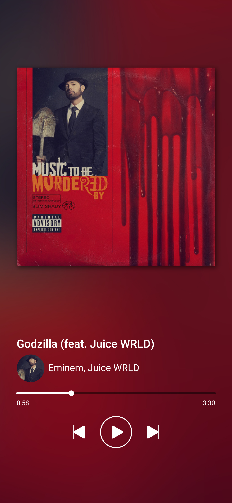

# Coool Player

Du skal de næste 5 dage programmere en web-player.

Du skal kode afspilleren efter ovenstående mockup og bruge de assets, som er vedhæftet dette repo.

Du skal selv finde resurser, som kan hjælpe dig med at få de forskellige funktionaliteter til at virke.

## Hovedopgave
Afspilleren skal kunne

* Afspille musik (play og pause)
* Skifte mellem forskellige numre (frem og tilbage)
* Spole i et enkelt nummer, både når musikken spiller og når den er på pause, ved at flytte trackeren på timelinen.
* Vise cover-art for det aktuelle nummer.

## Ekstraopgave
Hvis du når at blive færdig med hovedopgaven og har ekstra tid, skal du lave Coool Player som en Progressive Web App (PWA).

Google har [en rigtig god tutorial](https://codelabs.developers.google.com/codelabs/your-first-pwapp/#0), som viser dig hvordan du laver en PWA.
